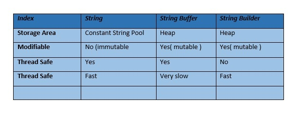

#Strings

---
###Q. ways to declare String in java?
```
1. String literal 
String str =  "Sample"
2.new keyword
String str = new String("Sample")
```
###Q. What is String pool?
Also known as SCP is special storage in heap memory to store unique string objects.

- Whenever new string is created, First checked in SCP, if present, the reference will be
pointing to existing object.
- If not present, it will create new String object and return the reference.

```
String s1 = "Apple";
String s2 = "Mango";
String s3 = "Apple";
Here, s1 == s3 ==> true, s1==s2 ==> false
As s3 will point to existing object created by s1.
```
###Q.  What does the string intern() method do in Java?
Ideally new String("Sample") creates a new String object. But if we use new String("Sample").intern(), it will first check in
SCP and if exist return existing or create new.

###Q. String vs StringBuffer vs String Builder


### Q. == vs equals()?
 The == compares references while equals() compares content.
 
###Q. Imp methods:

####1. substring()
#### substring(beginIndex, endIndex) -> beginIndex is inclusive, endIndex is exclusive
```
 String str = "Scaler by InterviewBit";
       
       //prints substring from 7th index
        System.out.print("Returns: ");
        System.out.println(str.substring(7));
        // prints substring from 0-6, exclusive 6th index
        System.out.print("Returns: ");
        System.out.println(str.substring(0, 6));
       // prints the substring from 10-22, exclusive 22th index
        System.out.print("Returns: ");
        System.out.println(str.substring(10, 22));
```

####2. split(): Split/divide the string at the specified regex.
####3. compareTo(): Compares two strings on the basis of the Unicode value of each string character.
####4. compareToIgnoreCase(): Similar to compareTo, but it also ignores case differences.
####5. length(): Returns the length of the specified string.
####6. equalsIgnoreCase(): Compares two strings ignoring case differences.
####7. contains(): Checks if a string contains a substring.
####8. trim(): Returns the substring after removing any leading and trailing whitespace from the specified string.
####9. charAt(): Returns the character at specified index.
####10. toLowerCase() , toUpperCase() : no need to explain
####11. concat(): Concatenates two strings

###Q. String.joiner()?
####We can make a string with specific prefix, suffix and delimiter.
```
 StringJoiner joinStrings = new StringJoiner(",", "[", "]");
       // passing comma(,) and square-brackets as delimiter   
         
       // Adding values to StringJoiner  
       joinStrings.add("Scaler");  
       joinStrings.add("By");  
       joinStrings.add("InterviewBit");            
       System.out.println(joinStrings);  
       //[Scaler,By,InterviewBit]
```

###Conversions:
###1. String to byte array
```String str = "Sample"; 
    String str = "Sample";
    byte[] arr = str.getBytes();
    System.out.println("String to byte array: " + Arrays.toString(byteArray));
```
###2. String to Integer and vice verse
 ####int i = Integer.parseInt("sample");
 #####String s = Integer.toString(1);